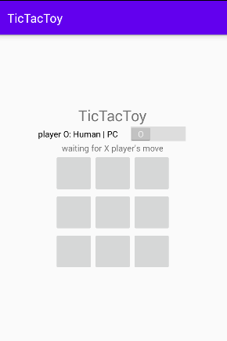
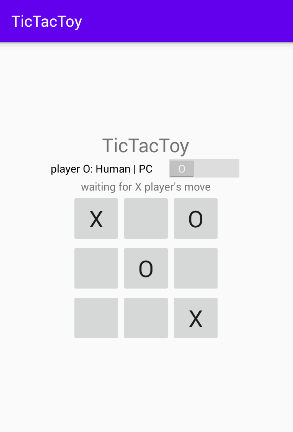
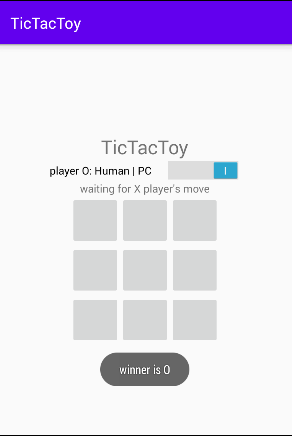

# TicTacToy

### О проекте
TicTacToy - игра "крестики-нолики".
Особенности:
- игрок "X" - всегда пользователь
- игрок "O" - пользователь, либо AI (переключать режим можно в процессе)
- в самом начале первым ходит игрок "X"
- после победы - первым начинает проигравший
- после ничьи - первым начинает тот, кто до этого начинал первым
- приложение поддерживает изменение ориентации экрана

Создаётся в рамках прохождения [курса по основам Android](https://job4j.ru/courses/android.html).

### Скриншоты

### Контакты
telegram: @vinogor